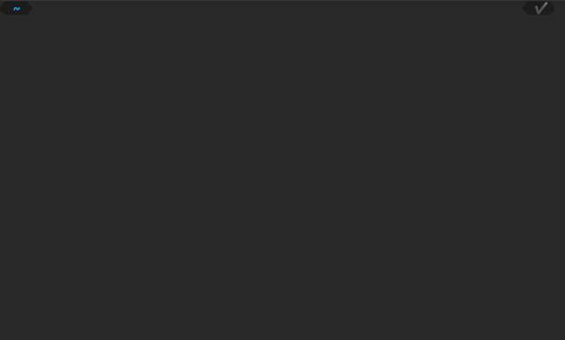

# oc_chess_club [](https://github.com/PabloLec/oc_chess_club/releases/) [](https://github.com/PabloLec/oc_chess_club/blob/main/LICENCE) [](https://github.com/psf/black)

:books: Made for an [OpenClassrooms](https://openclassrooms.com) studies project.

oc_chess_club manages tournaments and players for a chess club.

---

<p align="center"><b>
 Have a look at the <a href=https://pablolec.github.io/oc_chess_club>documentation</a> 
</b></p>

---

## Demo

<p align="center">
    
</p>

## Dependencies

Main dependencies are [typer](https://github.com/tiangolo/typer/) for the CLI part and [TinyDB](https://github.com/msiemens/tinydb) for the lightweight database.

You will need **Python 3.9+** as the project type hints generics from standard collections. (See [PEP 585](https://www.python.org/dev/peps/pep-0585/))

## Installation

#### :penguin: Linux / :apple: macOS

```console
python3 -m venv env
source env/bin/activate
python3 -m pip install oc-chess-club
```

#### :framed_picture: Windows
```console
py3 -m venv env
.\env\Scripts\activate
py3 -mpip install oc-chess-club
```

## Usage

To start the CLI, simply type:

```console
python3 -m oc_chess_club
```

To learn more, please refer to the [documentation](https://pablolec.github.io/oc_chess_club) (:fr:).

## Flake8

To generate a Flake8 HTML report you will need [flake8](https://github.com/PyCQA/flake8) and [flake8-html](https://github.com/lordmauve/flake8-html). Both are present in this project's dev dependencies.

Then, go to project's main directory and type:

```console
python3 -m flake8 --format=html --htmldir=docs/flake-report
```

## License

This project is licensed under the terms of the MIT license.
